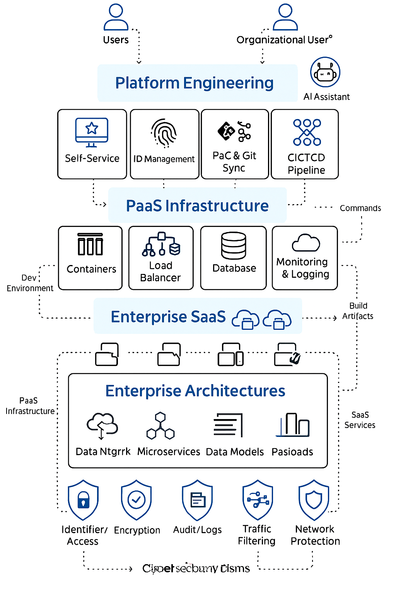

# Platform Engineering: PaaS-Scripts

## 🌐 Overview
This repository demonstrates **Platform as a Service (PaaS)** engineering patterns, orchestration, and developer experience platforms.  
It also highlights **data engineering workflows** that extend platform engineering into ingestion, transformation, storage, and analytics. It blends **PaaS** and **SaaS** concepts depending on the layer of platform engineering, showcasing reusable infrastructure, orchestration, developer experience platforms, and now **data engineering workflows**.

---

## 🔑 Engineering Domains
- **Developer Experience Engineering** → AI-powered dev portals, feature flag systems  
- **Data Engineering** → ETL pipelines, data mesh, DAMA dashboards, synthetic data generation  
- **MLOps Engineering** → Model deployment platforms, feature stores, registries  
- **Integration Engineering** → API gateways, service discovery, traffic routing  
- **Identity & Access Engineering** → Smart IAM, adaptive authentication platforms  

---

## 🧠 PaaS AI Intelligence Platform
- [AI-Powered Developer Experience Platform](./AI-PoweredDeveloperExperiencePlatform)  
- [Data-Driven Feature Flag System](./Data-DrivenFeatureFlagSystem)  
- [Self-Healing Infrastructure](./Self-HealingInfrastructurePlatform)  

---

## 📚 SWEBOK Alignment
- **Software Requirements** → Capturing platform needs across teams  
- **Software Design** → Platform architecture diagrams and workflows  
- **Software Testing** → ETL pipeline validation, schema evolution tests  
- **Software Engineering Management** → Platform lifecycle, governance, and compliance  

---

## 📊 Data Engineering Platforms
This repository also highlights **data engineering projects** that extend platform engineering into **data ingestion, transformation, storage, and analytics**:

- **High-Throughput Blockchain Pipeline (Solana Geyser)**  
  Real-time ingestion and decoding of Solana validator node data (transactions, accounts, blocks).  
  Includes optimized database schema, ETL scripts, and analytics queries for top buyers/sellers, ROI wallets, and token transfers.

- **DAMA-DMBOK Domain Mapping Dashboards**  
  Python dashboards (Seaborn, Plotly, Matplotlib) that map enterprise schemas to DAMA domains and generate interactive, branded storytelling reports.  
  Supports schema refresh, lineage tracking, and AI/ML domain extensions.

- **Synthetic Data Generation Platform**  
  Privacy-preserving synthetic datasets for testing and ML workflows.  
  Includes GAN-based tabular synthesis, schema-driven generation, and compliance wrappers (HIPAA/GDPR).

- **Data Mesh Deployment with IaC**  
  IaC-driven orchestration of domain-oriented data mesh, integrating ML-based routing, schema evolution, and decentralized ownership.

- **MLOps Data Infrastructure**  
  IaC modules for GPU clusters, feature stores, and registries to support ML training, deployment, and monitoring.

---

## ⚙️ Mostly PaaS (Platform As a Service)
These components lean heavily on PaaS for customization, orchestration, and deployment:
- **LangChain Agents, FastAPI, Azure ML, MLflow, Feast** → Developer-centric tools for building and deploying custom AI services  
- **Azure SQL, Azure Blob Storage, Redis, Postgres, Pinecone** → Platform-managed services for data storage and querying  
- **Power Automate / Azure Data Factory / Synapse** → Integrated data pipelines and task automation  

---

## 📦 Sometimes SaaS (Software As a Service)
SaaS enters the picture when consumed as packaged applications:
- **Power BI dashboards / Power Apps frontends** → No-code apps providing business-ready interfaces  
- **Sentinel (security monitoring), Purview (data governance)** → Operational tools consumed as turnkey software  
- **GPT-4, Claude via Azure, Ollama local LLMs** → SaaS if using hosted inference endpoints  

---
## Hybrid Platform Engineering Architecture
# 🧰 Hybrid Platform Engineering Architecture  
**Powered by Azure, AWS, and AI Native Tools**

This architecture integrates cloud-native services from Azure and AWS with AI-driven components to deliver scalable, secure, and intelligent platform engineering. Below is a categorized list of tools and services used across layers.

---

## 🧠 AI & Cognitive Services
- **Azure AI**: Azure OpenAI, Azure Cognitive Services, Azure Machine Learning  
- **AWS AI/ML**: Amazon SageMaker, AWS Bedrock, Amazon Comprehend, Amazon Rekognition  

---

## ☁️ Platform Engineering Layers
- **Developer Experience**: Self-Service Portals, ID Management, GitHub Sync, CI/CD Pipelines  
- **Infrastructure Automation**: Azure Automation, AWS Systems Manager  
- **CI/CD**: Azure DevOps, GitHub Actions, AWS CodePipeline, Jenkins  
- **Infrastructure as Code**: Azure Resource Manager (ARM), AWS CloudFormation, Terraform  

---

## 🔧 Azure Native Tools & Components
- **Identity & Access**: Azure Active Directory (AAD), Azure Key Vault  
- **Networking**: Azure Virtual Network (VNet), Azure Front Door, Azure DNS  
- **Compute & Containers**: Azure Kubernetes Service (AKS), Azure Functions  
- **Storage**: Azure Blob Storage  
- **Monitoring & Security**: Azure Monitor, Azure Defender, Azure WAF  

---

## 🔧 AWS Native Tools & Components
- **Identity & Access**: AWS IAM, AWS Secrets Manager  
- **Networking**: Amazon VPC, AWS Route 53, AWS ELB  
- **Compute & Containers**: Amazon ECS, Amazon EKS, AWS Lambda  
- **Storage**: Amazon S3  
- **Monitoring & Security**: Amazon CloudWatch, AWS GuardDuty, AWS WAF  

---

## 🔐 DevSecOps & Security
- **Security Controls**: TLS, HTTPS, OAuth2, JWT, Multi-Domain Zones  
- **DevSecOps Tools**: Argo CD, GitOps, Kubernetes RBAC, OPA (Open Policy Agent)  
- **Audit & Compliance**: CloudTrail (AWS), Azure Activity Logs, NIST/ISO mappings  

---

## 🔄 Data Flow & Integration
- **Data Lakes & Pipelines**: Azure Data Lake, AWS Glue, Amazon Redshift  
- **API Gateways**: Azure API Management, Amazon API Gateway  
- **Protocol Support**: HTTP/HTTPS, gRPC, WebSockets, REST, GraphQL  

---

## 🧩 Layer Classification Matrix

| Layer                  | Classification                          |
|-------------------------|------------------------------------------|
| Data & Model Ops        | PaaS                                     |
| Agent Workflows         | PaaS                                     |
| Compliance Dashboards   | SaaS (UI-focused), PaaS (API-driven)     |
| LLM Access              | SaaS (hosted), PaaS (local)              |
| UI Portals              | SaaS (low-code), PaaS (custom dev)       |
| Data Engineering        | PaaS (pipelines, mesh, dashboards)       |

---

## 📌 Summary
This hybrid architecture enables **multi-cloud orchestration**, **AI-enhanced developer experience**, and **secure, scalable platform engineering** across domains. It blends **Azure**, **AWS**, and **AI-native services** to support modern enterprise workloads with compliance, resilience, and innovation at scale.

## ⚠️ Disclaimer
This repository is intended for **demonstration, architecture reference, and internal collaboration** only.  
All content—including code, documentation, diagrams, and configuration—is proprietary to **Shaila Patel**.  
Unauthorized copying, reuse, or redistribution is strictly prohibited.  
Please contact the owner for written permission before referencing or adapting any material.

🧠📦🚀
---
 

